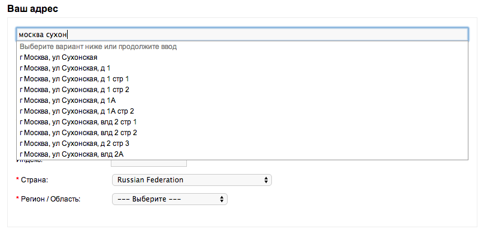
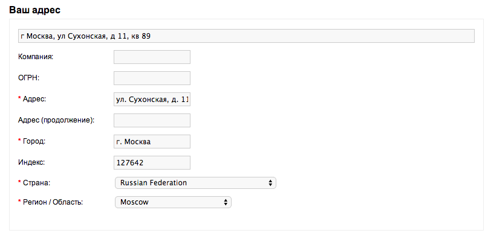
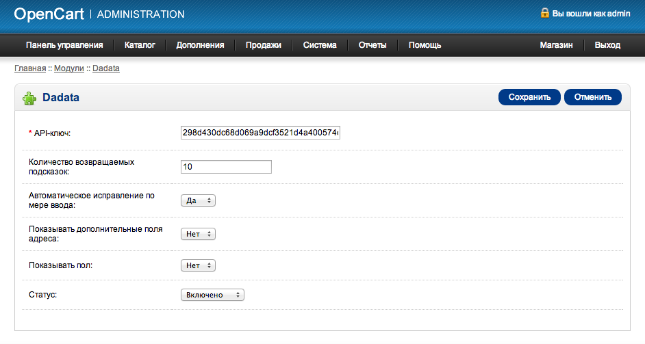
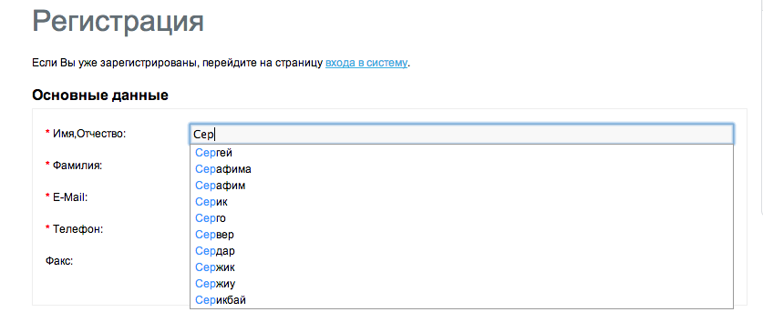

Подсказки DaData.ru для OpenCart
================================

Описание
---------------

Модуль выводит подсказки по ФИО и почтовому адресу, а также автоматически определяет почтовый индекс на странице регистрации и оформления заказа в OpenCart при помощи сервиса "Подсказки" [DaData.ru] (https://dadata.ru).




По отзывам интернет-магазинов, модуль значительно повышает качество получаемых от пользователей данных. Клиенты начинают указывать почтовые адреса для доставки, разбитые по КЛАДР, без опечаток и с квартирами, индекс определяется автоматически. ФИО вводят без опечаток и с полом.
 
OpenCart 1.5.6.x.
OcStore 1.5.5.x.

Установка
---------

### 1. Установите модуль

Прежде всего, скачайте [дистрибутив](hhttps://github.com/hflabs/suggestions-opencart/releases/latest), распакуйте его, и скопируйте файлы из каталога `upload` в корень opencart-магазина.

Для замены регионов России на корректные значения из КЛАДР выполните SQL-скрипт `zone.sql` над БД магазина через phpMyAdmin либо из консоли:

```
$ mysql opencart -u opencart -p < zone.sql
```

### 2. Включите подсказки в настройках

Модуль настраивается в админке по адресу: *Дополнения > Модули > DaData*.



*API-ключ* — необходимо получить в [личном кабинете](https://dadata.ru/profile/#info) DaData.ru.

*Количество возвращаемых подсказок* — количество подсказок, которое демонстрируется пользователю.

Оставшиеся поля настройки (автоматическое исправление по мере ввода, показывать дополнительные поля адреса, показывать пол) управляют поведением подсказок. Вы можете включить их по необходимости.

*Статус* – показывает статус работы модуля: «включено» – подсказки работают, «отключено» – подсказки не работают.

*Версия подсказок* — какой сервис использовать при работе (подробнее см. [Версии подсказок] (https://dadata.ru/suggestions/#pricing)). 

После заполнения всех полей необходимо сохранить настройки.

#### Настройки для работы с модулем simple checkout

Для корректного выбора региона - установите Российскую федерацию в качестве страны по умолчанию в настройках модуля *Simple Checkout > Поля > country_id > Значение по умолчанию*

### 3. Пользуйтесь подсказками!

Подсказки работают при вводе ФИО и адреса во время регистрации и оформления заказа:




История изменений
-----------------
* 1.3
 * Добавлена поддержка OcStore 
* 1.2
 * Добавлена поддержка simplecheckout (спасибо [deeman](https://opencartforum.com/user/16563-deeman/))

* 1.1 
 * Добавлена возможность использовать платную версию сервиса
 * Переписан код модуля - больше не нужно править исходники магазина.
 
* 1.0
 * Первый релиз
